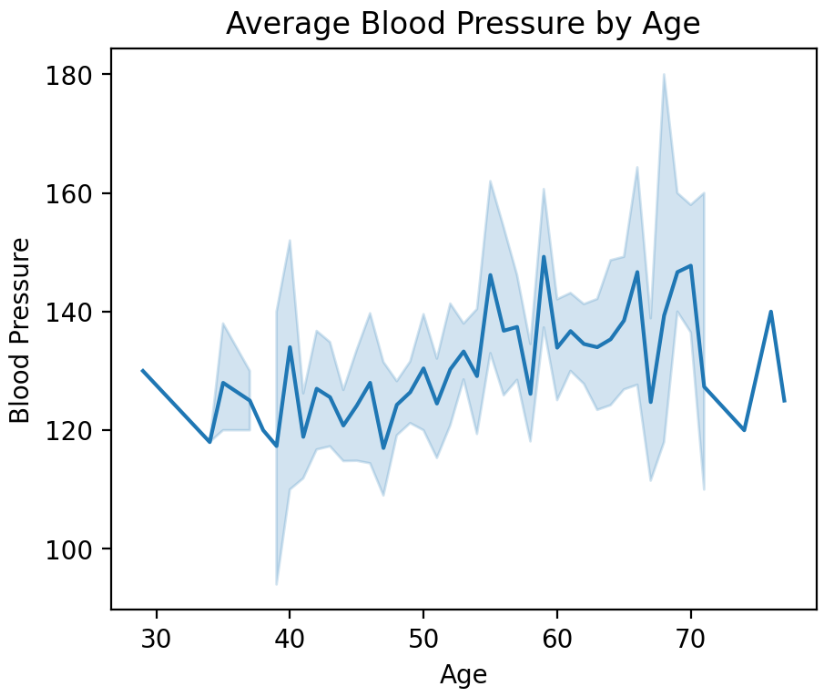

# ❤️ Heart Disease – Exploratory Data Analysis (EDA)

This project presents an **Exploratory Data Analysis (EDA)** of a heart disease dataset using **Python** and **Streamlit**.  
The goal is to analyze clinical variables, visualize relationships, and extract insights that may help understand cardiovascular risk patterns.

👉  [**Live App**](https://eda-heart-disease-inwh7rentomffqx6zbjs5y.streamlit.app/)  

---

## 📌 Project Overview

Cardiovascular diseases are among the leading causes of death worldwide.  
This project explores a heart disease dataset through interactive visualizations, enabling:

- Understanding distributions of clinical variables  
- Identifying relationships between age, blood pressure, cholesterol, and other indicators  
- Supporting future feature engineering and predictive modeling  

The analysis is delivered as an **interactive Streamlit dashboard**, making the results accessible and easy to explore.

---

## 📊 Dataset

- **File:** `heart.csv`
- **Type:** Structured clinical dataset
- **Content:** Demographic and medical attributes related to heart disease

### Main variables include:
- Age  
- Blood Pressure (BP)  
- Cholesterol  
- Maximum Heart Rate (Max HR)  
- ST Depression  
- Chest Pain Type  
- Thallium Test  
- Heart Disease (target variable)

> The dataset is included directly in the repository for reproducibility.

---

## 🧠 Key Analyses Performed

- Descriptive statistics of clinical variables  
- Age distribution and blood pressure trends  
- Histograms of selected medical indicators  
- Relationship between age and cholesterol using density plots  
- Correlation analysis between numerical features  

All visualizations are interactive and rendered dynamically using Streamlit.





---

## 🖥️ Application Features

- Interactive dashboards built with **Streamlit**
- Responsive layout (desktop & mobile-friendly)
- Cached data loading for faster performance
- Clean and organized visualizations using **Matplotlib** and **Seaborn**

---

## 🛠️ Technologies Used

- Python  
- Pandas  
- NumPy  
- Matplotlib  
- Seaborn  
- Streamlit  

---

## 🚀 How to Run Locally

1. Clone the repository:
   ```bash
   git clone https://github.com/Guilhermestella29/EDA-Heart-Disease.git
   cd EDA-Heart-Disease
